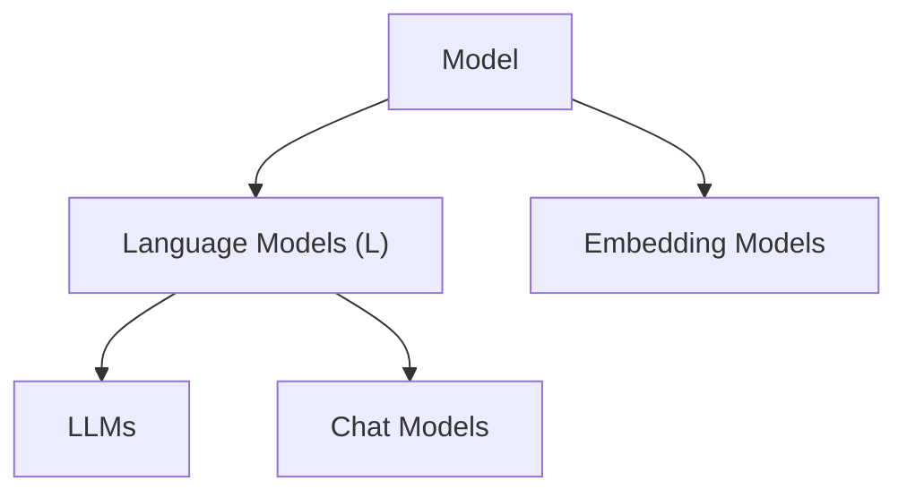

> # LangChain Models
- (LLMs demo) https://github.com/campusx-official/langchain-models 
- (Docs) https://docs.langchain.com/oss/python/langchain/models

**LangChain Models**: 

1. **Language Models**: These models are huge in size making it difficult to setup on local machine. You can use paid APIs for these. OpenAI, Claude, Gemini, HuggingFace (Open Source),... 
    - LLMs: General purpose models for raw text generation.
    - Chat Models: Specialized for conversational tasks. Understands system, user, assistant roles. __Top open-source chat models as of 2026 include Qwen3, DeepSeek-V3, Meta Llama 3.1, and Mistral, etc__
2. **Embedding Models**: These models are usually very cheap and even can be downloaded locally as well. OpenAI, HuggingFace (Open Source),... 

> # About HuggingFace (GitHub of AI)
**Hugging Face** is a leading **open-source platform and company** in the artificial intelligence and machine learning space, often described as the "GitHub of AI" or "the home of machine learning." It provides tools, libraries, and a collaborative hub where developers, researchers, and organizations can discover, share, build, and deploy machine learning models, datasets, and applications. **URL**: https://huggingface.co/models

### Core Offerings
Hugging Face revolves around the **Hugging Face Hub**, a central web platform (like a repository) for collaboration:

- **Models**: Hosts over **2 million** models (as of early 2026), covering text, image, video, audio, 3D, and multimodal tasks. Popular examples include variants of Llama, Gemma, Qwen, DeepSeek, and diffusion models. You can browse, download, fine-tune, or deploy them easily.
- **Datasets**: Hundreds of thousands of datasets for training and evaluation across ML tasks.
- **Spaces**: Allows users to build and host interactive AI demos/apps (powered by tools like Gradio, which Hugging Face acquired). There are over a million such applications.

Key open-source libraries include:
- **Transformers** — The flagship library for state-of-the-art models (supports PyTorch, TensorFlow, JAX). It handles tasks like text generation, classification, translation, computer vision, audio processing, and more.
- **Datasets** — For easy loading, processing, and sharing of data.
- **Diffusers** — For diffusion models (e.g., image/video generation).
- Others like **Tokenizers**, **PEFT** (parameter-efficient fine-tuning), **Accelerate**, **Safetensors** (secure weights storage), and more.

These tools make it simple to go from research to production without reinventing the wheel. The platform supports inference endpoints, compute resources (GPUs), enterprise plans for teams (with security features), and unified APIs for accessing thousands of models.
