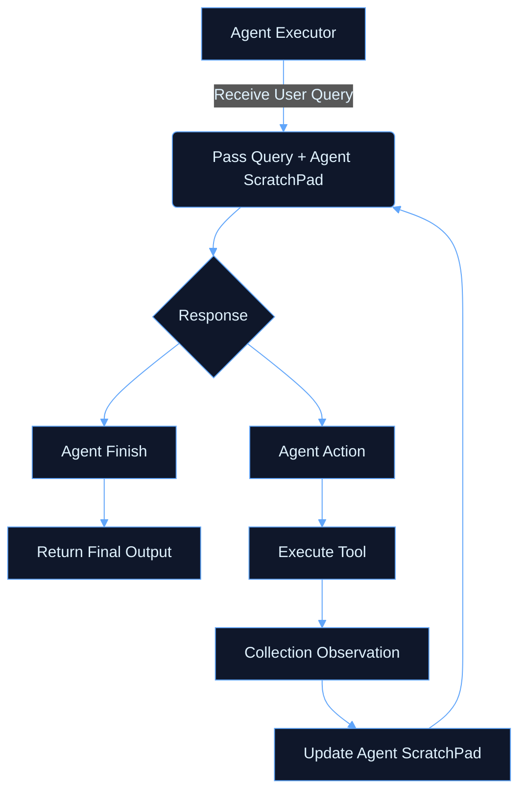

> # 1. Creating Agents

### Reference:
- Video: https://www.youtube.com/watch?v=gm_lQG8fYjI&list=PLKnIA16_RmvaTbihpo4MtzVm4XOQa0ER0&index=20
- Colab: https://colab.research.google.com/drive/1O7cdBtiP_GNXgL9Iz4LPzYfvTKtMtv25?usp=sharing

**Agent**: An AI Agent is an intelligent system that receives a high-level goal from user , and autonomously plans, decides and executes a sequence of actions by using external tools, APIs, or knowledge sources - all while maintaining context, reasoning over multiple steps, adapting to new information, and optimizing for the intended outcome.

**ReAct**: ReAct is a design pattern used in AI Agents for Reasoning + Acting. It allows a language model   to interleave internal reasoning (thought) with external actions (like tool use) in a strcutured, multi step process.

Instead of generating an answers in one go, the model thinks step by step, deciding what it needs to do next and optionally calling tools (APIs, calculators, web search, etc) to help it.

## Agent Vs Agent Executor:
An Agent acts as the "brain" (LLM + prompt + tools) that decides which action to take, while the Agent Executor is the runtime or "engine" that actually executes those actions, loops through tool calls, and manages memory. Essentially, the Agent decides, and the Agent Executor does.

**Creating an Agent**
Example Prebuild prompt: https://smith.langchain.com/hub/hwchase17/react
```python
agent = create_react_agent(
    llm=llm,
    tools=[search_tool],
    prompt=prompt
)
```
**Creating Agent Executor**
```python
agent_executor = AgentExecutor(
    agent=agent,
    tools=[search_tool],
    verbose=True
)
```
Below is a flowchart to understand it better:



### Agent Code: Agent that brings weather data of any user requested city.

```python
import os
os.environ["OPENAI_API_KEY"] = "sk-proj-..."
!pip install -q langchain-openai langchain-community langchain-core requests duckduckgo-search

from langchain_openai import ChatOpenAI
from langchain_core.tools import tool
import requests
from langchain_community.tools import DuckDuckGoSearchRun
from langchain.agents import create_react_agent, AgentExecutor
from langchain import hub

search_tool = DuckDuckGoSearchRun()

@tool
def get_weather_data(city: str) -> str:
  """
  This function fetches the current weather data for a given city
  """
  url = f'https://api.weatherstack.com/current?access_key=4d1d8ae207a8c845a52df8a67bf3623e&query={city}'
  response = requests.get(url)
  return response.json()

llm = ChatOpenAI()
# Step 2: Pull the ReAct prompt from LangChain Hub
prompt = hub.pull("hwchase17/react")  # pulls the standard ReAct agent prompt
# Step 3: Create the ReAct agent manually with the pulled prompt
agent = create_react_agent(
    llm=llm,
    tools=[search_tool, get_weather_data],
    prompt=prompt
)

# Step 4: Wrap it with AgentExecutor
agent_executor = AgentExecutor(
    agent=agent,
    tools=[search_tool, get_weather_data],
    verbose=True
)

# Step 5: Invoke
response = agent_executor.invoke({"input": "Find the capital of Madhya Pradesh, then find it's current weather condition"})
print(response)
response['output']
```