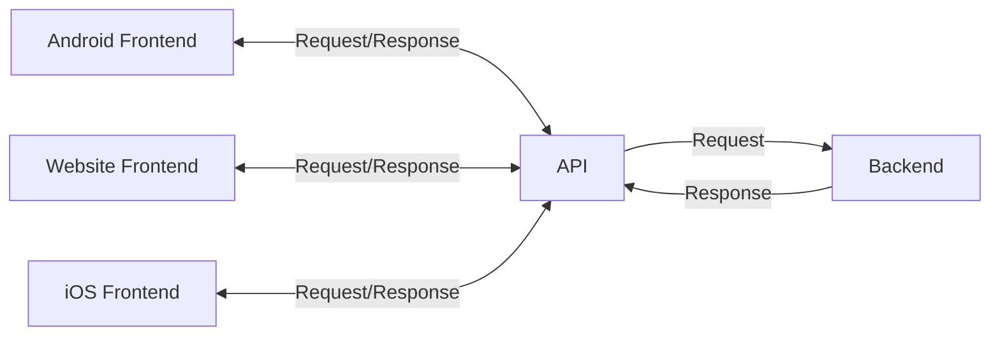

> # What is API?
APIs are mechanism that enable two software applications to communicate with each other. They define a set of rules and protocols for how different software components should interact, allowing them to exchange data and functionality seamlessly.


### Understanding the need for APIs:
**Monolithic Architecture**: In a monolithic architecture, all components of an application are tightly integrated and run as a single unit. You delelop your frontend and backend together in same directory, making it difficult to maintain and scale the application as it grows. Here your backend and frontend are tightly coupled, meaning that changes in one part of the application can affect the entire system.

**API-Based Architecture**: API architecture solves this problem by decoupling the frontend and backend. The frontend can be developed independently of the backend, and they communicate through well-defined APIs. This allows for greater flexibility, scalability, and maintainability.



> # What is FastAPI
FastAPI is a modern, high-performance web framework for building APIs with Python. 
- For webserver, FastAPI uses Uvicorn, which is an ASGI server that provides high performance and scalability.
- ASGI (Asynchronous server gateway interface) is a specification for building asynchronous web servers and applications in Python. It allows for handling multiple requests concurrently, making it suitable for high-performance applications.
- FastAPI is built on top of Starlette for the web parts and Pydantic for the data handling, which provides a powerful and efficient way to create APIs.
- Asynchronous EndPoints: FastAPI allows you to define asynchronous endpoints using the `async` keyword, which can improve performance by allowing the server to handle multiple requests concurrently without blocking.

> # Hello World

### 01. Install Dependencies
```shell
pip install fastapi uvicorn pydantic
```

### 02. Create a FastAPI Hello World Application:
1. Create a file main.py with below code.
2. Run: ```uvicorn main:app --reload```.
3. Check home page: http://127.0.0.1:8000
4. Check about page: http://127.0.0.1:8000/about
5. Check API documentation: http://127.0.0.1:8000/docs
```python
from fastapi import FastAPI
app = FastAPI()

@app.get("/")
def hello_world():
    return {"message": "Hello, World!"}

@app.get("/about")
def about():
    return {"message": "This is a simple FastAPI application."}
```

> # 4. HTTP Methods:
HTTP methods are used to indicate the desired action to be performed on a resource. The most common HTTP methods are:
- **GET**: Retrieve data from the server.
- **POST**: Send data to the server to create a new resource.
- **PUT**: Update an existing resource on the server.
- **DELETE**: Remove a resource from the server.